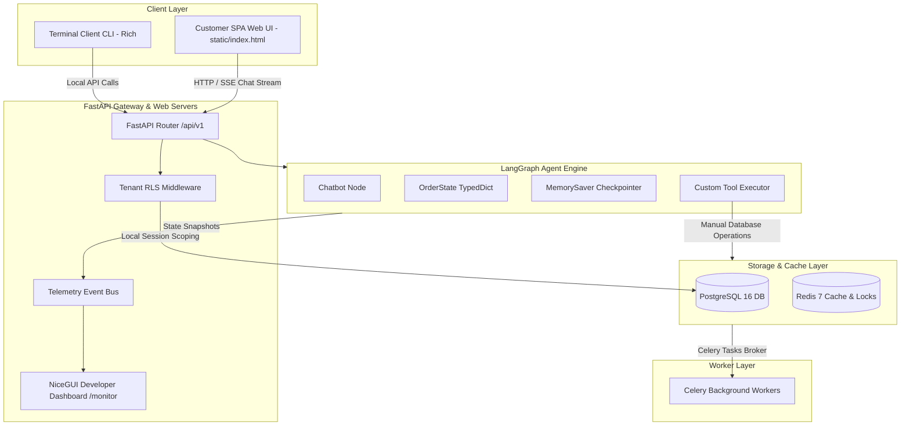
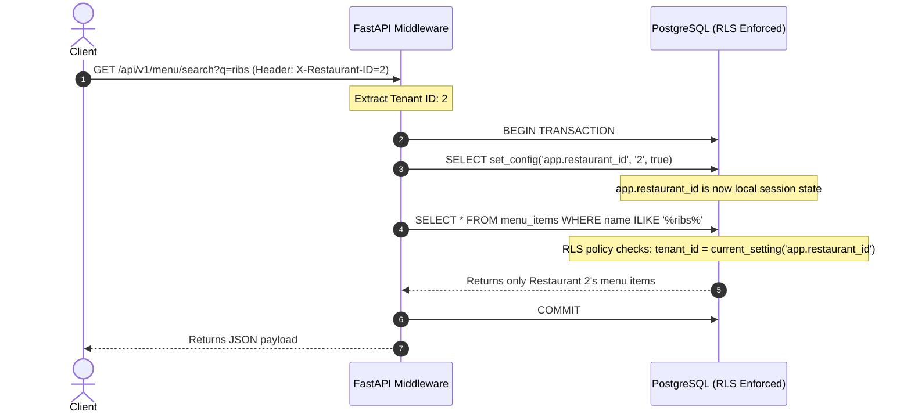
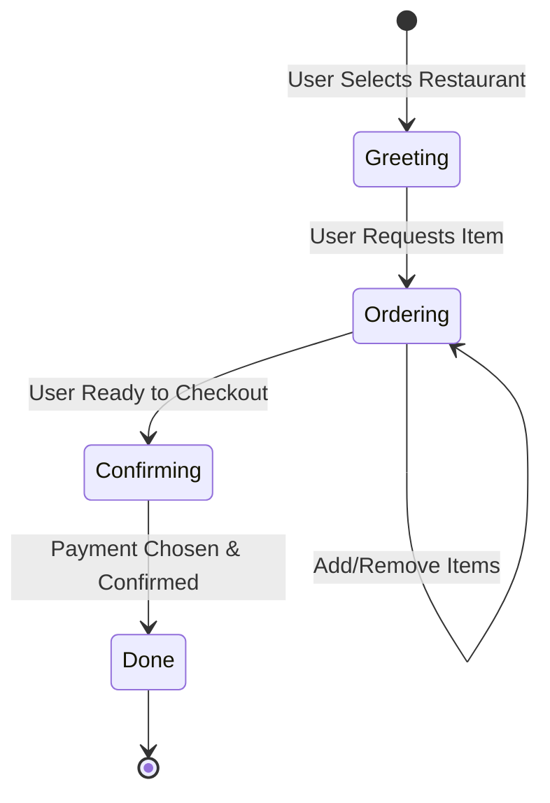

# System Architecture Specification

This document provides a production-grade architectural specification for the **Multi-Restaurant AI Ordering System**. It outlines the core system design, data modeling, multi-tenant security enforcement, concurrency mechanisms, stateful agent lifecycle, and telemetry infrastructure.

---

## 1. System Topology & Architectural Overview

The system utilizes a modern, decoupled architecture designed for high availability, low-latency execution, and secure multi-tenant isolation. It bridges real-time customer interactions with background operational workers.



### Component Breakdown & Technology Choices

| Component | Technology | Rationale |
| :--- | :--- | :--- |
| **API Gateway** | FastAPI (Python 3.12) | Asynchronous ASGI framework providing native ASGI streaming (for LLM tokens via SSE) and high-performance routing. |
| **Stateful AI Orchestration** | LangGraph (LangChain) | Enables cyclic graph routing. Decouples prompt logic, tool classification, and tool execution into structured, testable nodes. |
| **Primary Database** | PostgreSQL 16 | ACID-compliant relational storage supporting Row-Level Security (RLS) for tenant separation and Trigram indexes for fuzzy menu searches. |
| **Cache & Lock Manager** | Redis 7 | High-speed cache for menu lists, atomic lock manager for order confirmations, and Celery broker. |
| **Developer Telemetry** | NiceGUI | Embedded, light-weight real-time UI that hooks into the internal event loop to inspect queries, latencies, and state transitions. |
| **Asynchronous Worker** | Celery + Redis | Offloads slow external tasks (e.g. printer/kitchen APIs, email receipt delivery) from the request-response thread. |

---

## 2. Multi-Tenant Database Design & Security

The system implements a **shared database, shared schema** multi-tenant model. Tenant isolation is enforced at the database layer using PostgreSQL **Row-Level Security (RLS)**.



### 2.1 Database Schema & Multi-Tenancy Rules

The schema consists of three primary tables: `restaurants`, `menu_categories`, `menu_items`, `orders`, and `order_items`. Multi-tenancy is enforced on all child tables by checking their foreign keys.

```sql
-- Enforce RLS on tables
ALTER TABLE menu_categories ENABLE ROW LEVEL SECURITY;
ALTER TABLE menu_items ENABLE ROW LEVEL SECURITY;
ALTER TABLE orders ENABLE ROW LEVEL SECURITY;
ALTER TABLE order_items ENABLE ROW LEVEL SECURITY;

-- Policy for Orders
CREATE POLICY orders_tenant_isolation ON orders
    FOR ALL
    USING (restaurant_id = NULLIF(current_setting('app.restaurant_id', true), '')::integer);
```

To execute a query:
1. Every service transaction must issue `SET LOCAL app.restaurant_id = :tenant_id` at startup.
2. If `app.restaurant_id` is unset or empty, the RLS policies return empty result sets, preventing accidental tenant leaks.
3. Database connection pooling is managed via `SQLAlchemy`'s AsyncSession wrapper, which dynamically resets session configurations after commits.

### 2.2 Text Search & Indexing Strategy

To facilitate quick menu queries (e.g., "Do you have any spicy tacos?"):
*   **Full-Text Search (FTS)**: We use PostgreSQL's `tsvector` columns and `tsquery` parsed terms. A GIN index on `search_vector` ensures sub-millisecond retrieval times.
*   **Fuzzy Trigram Matching**: As a fallback for typos ("tacos" -> "tccos"), we enable the `pg_trgm` extension and use a GiST index on the menu item names.

---

## 3. Concurrency Control & Caching (Redis 7)

Redis 7 optimizes application responsiveness and safeguards transaction integrity.

### 3.1 Cache-Aside Pattern for Menu Data

Menus are static data and are retrieved frequently. The system implements a strict **Cache-Aside** strategy:

```
[Request Menu] ──> Read from Redis ──(Hit)──> Return Data
                      │
                   (Miss)
                      ▼
               Read from Postgres
                      │
               Write to Redis (TTL 1 hour)
                      │
                 Return Data
```

*   **Cache Invalidation**: On modifying, deleting, or adding menu items via the management portal, the cache key `restaurant:{id}:menu` is immediately purged, guaranteeing zero stale menu reads.

### 3.2 Distributed Lock for Order Confirmation

To prevent double-submission errors or race conditions during payment processing, a distributed lock is acquired before compiling the checkout state:

```python
# redis_client.py
lock_key = f"lock:order:confirm:{order_id}"
# Acquire lock with a 5-second auto-expiry
acquired = await redis.set(lock_key, "1", ex=5, nx=True)
if not acquired:
    raise HTTPException(status_code=409, detail="Order confirmation in progress")
```

The lock guarantees that only one request can process the payment transitions in PostgreSQL for a given order ID.

### 3.3 Popularity Tracking via Sorted Sets

When an order is confirmed, ordered quantities are incremented in a Redis Sorted Set (`zset`):
```python
# Increment popularity score by quantity
await redis.zincrby(f"restaurant:{restaurant_id}:popular_items", quantity, item_name)
```
The client can fetch the top 5 trending items instantly via `ZREVRANGEBYSCORE` without running expensive aggregations over transactional tables.

---

## 4. Stateful Agent Lifecycle (LangGraph)

The AI ordering interface is modeled as a state machine where state is preserved in an asynchronous checkpointer.



### 4.1 State Structure (`OrderState`)

The state schema is defined as:
```python
class OrderState(TypedDict):
    messages: Annotated[list[AnyMessage], add_messages]
    restaurant_id: int
    session_id: str
    customer_name: Optional[str]
    cart: list[dict]
    order_id: int
    stage: str  # greeting | ordering | confirming | done
    menu_text: str
    error_message: Optional[str]
```

### 4.2 Custom Node Execution

Rather than allowing the LLM to write to database nodes directly, the system uses a **custom manual tool executor**:
1. The LLM suggests tools (e.g. `add_item_to_order(item_name="Cheese Pizza", quantity=2)`).
2. The `tool_executor` node intercepts the tool request and validates parameters.
3. The executor runs the action inside a local transactional database scope (guaranteeing RLS boundaries).
4. The database triggers automatically recalculate order subtotals and sync them back to the `cart` and `total` state keys.
5. The LLM is invoked again to formulate a clean, human-readable response based on the updated state.

---

## 5. Developer Dashboard & Telemetry Pipeline

Observability is integrated directly into the system using a real-time event telemetry bus.

```
[System Layer] ──> bus.emit(Event) ──> EventBus ──> nicegui.tick() ──> Developer Dashboard (/monitor)
```

*   **Database Query Logging**: Listens to SQL execution hooks. It sanitizes queries to mask sensitive parameters, tracks transaction durations, and categorizes queries by target table.
*   **Redis Tracking**: Wraps cache client calls, logging Cache Hits/Misses, Key operations, TTL durations, and execution latencies.
*   **LLM Latency Tracing**: Captured via custom LangChain `BaseCallbackHandler` classes (`MonitorCallback`), capturing prompt inputs, response token lengths, and inference speed.
*   **Tool Executions**: Logged directly by the manual tool executor to capture precise execution times and input/output payloads.

---

## 6. Production Deployment & Scaling Guidelines

### 6.1 Horizontal Scaling & Application Gateways

To scale the FastAPI app horizontally:
1. **Stateless Web Nodes**: The FastAPI nodes must remain stateless. All session checkpointer details are stored in Postgres (or can be moved to a Redis-backed LangGraph checkpointer `RedisSaver`).
2. **Session Sticky Routing**: Use an Nginx or ALB load balancer configured with cookie-based sticky sessions or session-consistent routing to minimize checkpointer reload latencies.

### 6.2 Database Configuration

*   **Read-Write Split**: Route all transaction writes and order checkpointer reads to a primary PostgreSQL instance, and direct static menu lookups to read-replicas.
*   **Connection Pool Sizing**: Set `pool_size` and `max_overflow` in SQLAlchemy to match execution concurrency limits to avoid exhausting PostgreSQL connections under peak loads.

### 6.3 Redis High Availability

*   **Redis Sentinel**: Configure Redis Sentinel for master-replica failover to prevent locking and caching failures.
*   **Eviction Policy**: Set the eviction policy to `volatile-lru` to protect transactional distributed locks and popularity sets from eviction, allowing only expired menu caches to be pruned.

### 6.4 Celery Worker Offloading

*   Run background workers in isolated pods. 
*   Separate queues: Define a `high-priority` queue for real-time printer/kitchen alerts and a `default` queue for analytics cache warming tasks.
